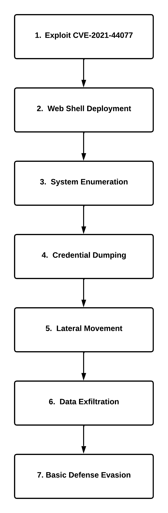

# Attack Roadmap

### Will the Real Msiexec Please Stand Up? Exploit Leads to Data Exfiltration

### Let's Summarize Each Step
#### 1. Exploit [CVE-2021-44077](https://nvd.nist.gov/vuln/detail/CVE-2021-44077) The exploit looks very similar to a publicly available POC exploit on [GitHub](https://github.com/horizon3ai/CVE-2021-44077).

 - Exploit Method: RCE via two HTTP requests. -
Request 1: POST request to /RestAPI/ImportTechnicians?step=1 contains `msiexec.exe` and was written to C:\Program Files\ManageEngine\SupportCenterPlus\bin\msiexec.exe.

Request 2: GET request to /RestAPI/s247action?execute=s247AgentInstallationProcess&apikey=asdasd, and invoke the uploaded `msiexec.exe`.

#### 2. Web Shell Deployment:
- The Malicous msiexec.exe contains encoded web shell once `msiexec.exe /i Site24x7WindowsAgent.msi EDITA1=asdasd /qn` there is a webshell file `jm2.jsp` written to `C:\Program Files\ManageEngine\SupportCenterPlus\custom\login\fm2.jsp`, this way will allow the threat actor to maintain the access with no need to execute the exploit once again.
- Now you have an access to the system through `http://<victim_ip:8080/custom/login/jm2.jsp`
